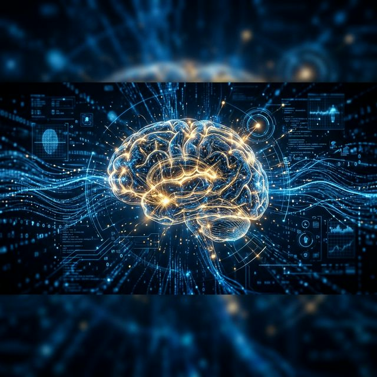
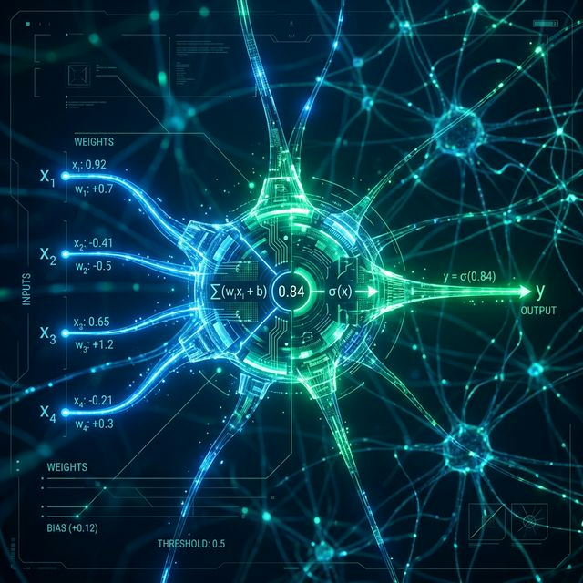
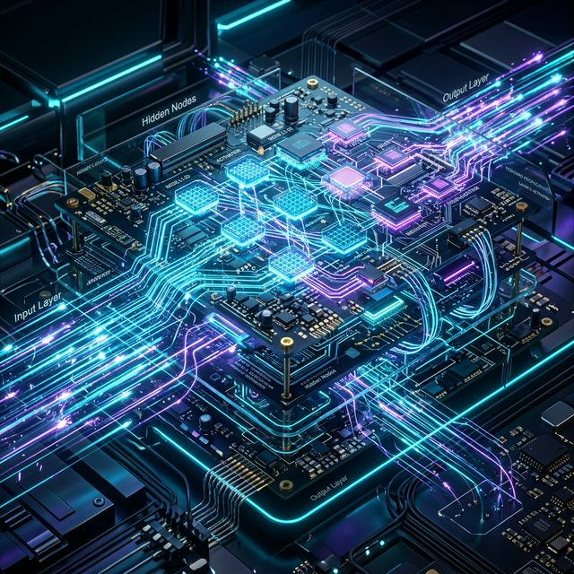
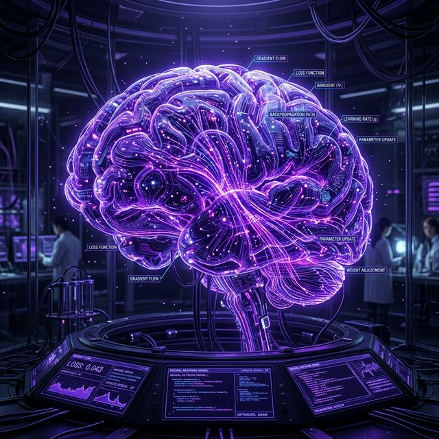
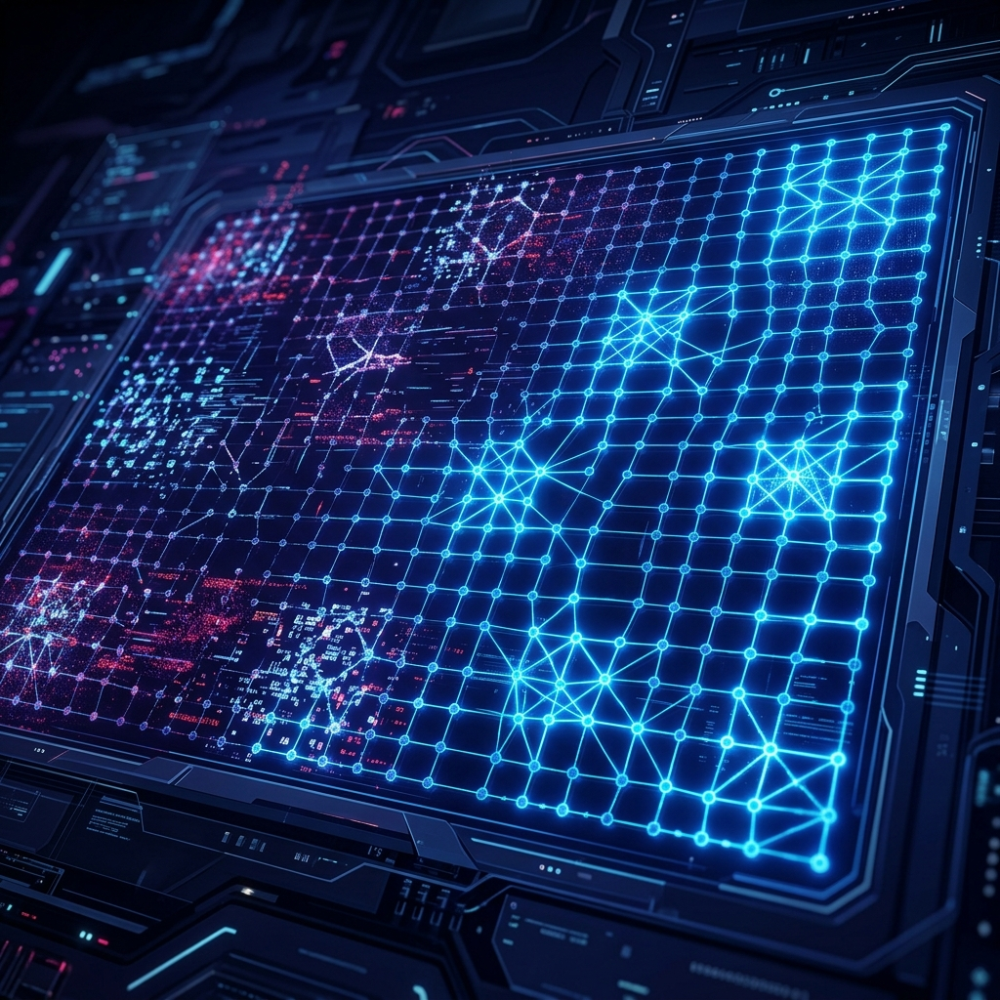
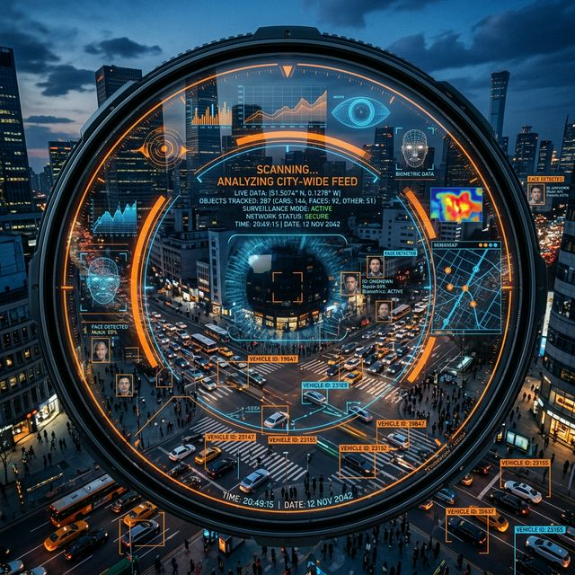
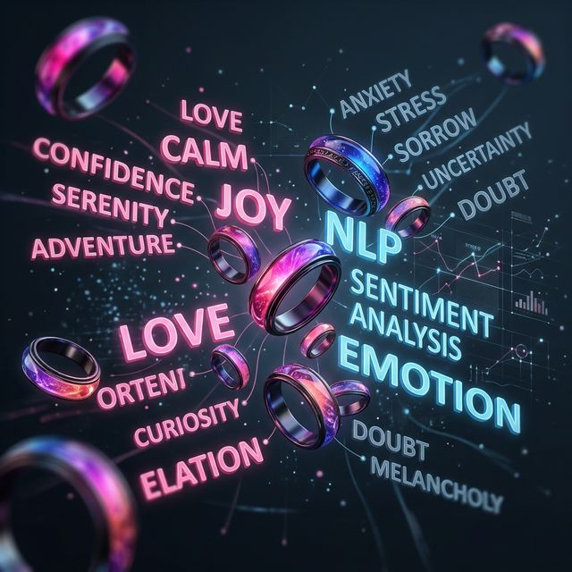
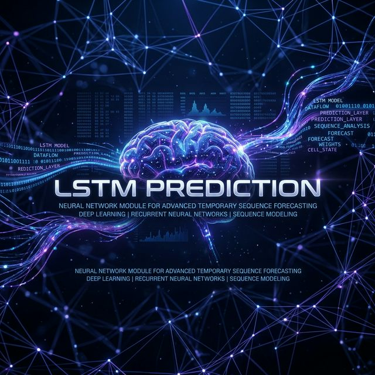

# 🧠 NEUROLAB: The Ultimate Neural Network Experience

[](https://neurolab.streamlit.app/)
[](https://neurolab.streamlit.app/)
[](https://www.python.org/)
[](https://opensource.org/licenses/MIT)



## 🌌 Overview

Welcome to **NeuroLab**, a premium, high-performance simulation suite designed to make Deep Learning intuitive, visual, and stunning. Built with a cinematic "Netflix-style" interface, NeuroLab transforms complex mathematical architectures into an interactive playground.

---

## 🚀 Live Access
Experience NeuroLab in your browser right now:
👉 **[Launch Live Demo](https://neurolab.streamlit.app/)**

---

## ✨ Platform Highlights

| 🎨 Cinematic UI | 🔍 Real-Time Insights | 🛠️ Custom Architectures |
| :--- | :--- | :--- |
| Glassmorphic layouts with high-performance animations and a premium dark mode. | Live activation heatmaps, gradient traces, and weight trajectory tracking. | Build and test per-layer configurations for MLP, LSTM, and Hopfield networks. |

---

## 🏛️ Core Modules

NeuroLab features seven dedicated environments for mastering Artificial Intelligence.

### 🟢 1. The Perceptron
*The Foundation of Learning*

- Watch a single neuron learn binary logic gates in real-time.
- Interactive decision boundary visualization.
- Instant confusion matrix generation.

### ➡️ 2. Forward Propagation
*The Signal Flow*

- Visualizing data transformation through multi-layer networks.
- Live activation heatmaps (Sigmoid, ReLU, Tanh, etc.).
- Real-time weight and bias manipulation.

### ⬅️ 3. Backward Propagation
*The Heart of Optimization*

- Master the Chain Rule through visual gradient flow.
- Automated weight convergence dashboard.
- Loss landscape exploration.

### 🧠 4. Hopfield Network
*Associative Memory*

- Explore recurrent neural architectures and energy landscapes.
- Pattern recovery and Hebbian learning simulations.
- Content-addressable memory visualization.

### 📷 5. OpenCV Detection Hub
*Vision Intelligence Suite*

- **YOLOv8 Intelligence**: Real-time vehicle counting and sign detection.
- **Biometric Hub**: Face scanning and automated attendance logging.
- **Gesture Control**: Hand landmark tracking via MediaPipe.

### 💬 6. Sentiment Analysis
*Text Intelligence*

- Deep language processing using LSTM cores.
- 8-emotion detection with confidence distribution.
- Mixed-sentiment tactical HUD.

### 🚀 7. LSTM Application Hub
*Sequence Synthesis*

- **Next-Word Prediction**: Forecasting logic in real-time.
- **Creative Story Gen**: AI-driven narrative synthesis.
- **Temperature Control**: Tweak creativity vs. predictability settings.

---

## 🛠️ Local Setup

Get NeuroLab running on your machine:

1. **Clone the Project**:
   ```bash
   git clone https://github.com/Anant-Goel2006/Neural-Network-Lab-Tool-Box.git
   cd Neural-Network-Lab-Tool-Box
   ```

2. **Install Dependencies**:
   *Recommended: Python 3.11+*
   ```bash
   pip install -r requirements.txt
   ```

3. **Run the Application**:
   ```bash
   streamlit run app.py
   ```

---

## 🧪 Technology Stack

NeuroLab leverages the best of Open Source AI:
- **Engine**: TensorFlow / Keras
- **Vision**: OpenCV & MediaPipe
- **Analytics**: NumPy & Pandas
- **UI**: Streamlit & Vanilla CSS
- **Visuals**: Plotly & Matplotlib

---

## 📜 License & Credits

Distributed under the **MIT License**. Created with 💖 for the AI community.

**Developed by the NeuroLab Team** 🚀
Bringing the future of AI to your fingertips.
